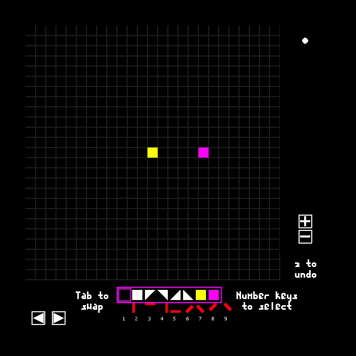

# Ringshot
Rings that shoot rings that shoot rings. A quick-fire slow-mo mouse action puzzle-palooza.

## Featuring
- 54 levels, with about 30-60 minutes of gameplay
- Self-coded physics
- A dynamic soundtrack that reacts to how you play
- A level editor

## To run this code, you'll need:
- Python 3.5+
- PyGame 1.9.4+

Run Ringshot.py to start the game.

## More GIFs

### Level Editor

### Level Select

